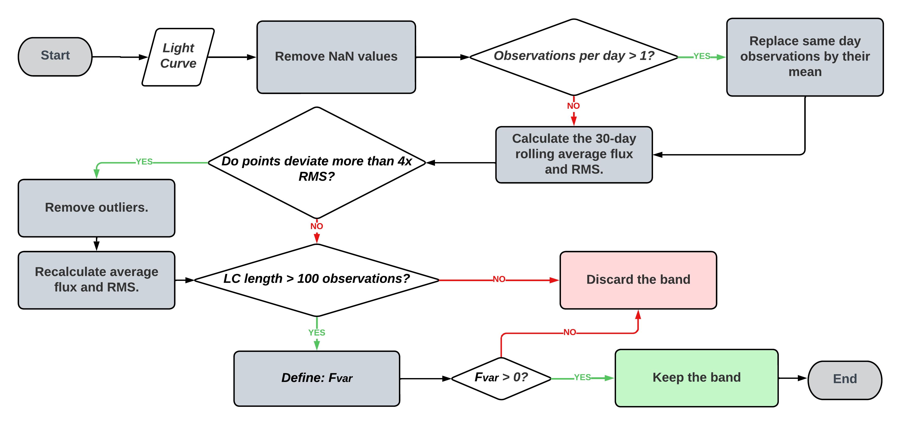

# ZTF-Data-Filters:
While handling ZTF data, I faced certain challenges with forced photometry data, including issues like repeated observations on the same day and NaN values. To address these issues, I implemented filters and reliability parameters. In this repository, I strive to share a detailed account of how I navigated through these challenges, hoping that it proves valuable to others interested in working with the same survey.

# About the code:
The '.rar' file contains a complete example of how to operate on the data obtained from the ZTF forced photometry service. In the file, you will find:

1) "plot" folder (output of the plot_lc() function with all the light curve plots).
2) "ztffp_raw_data" folder (where the downloaded ZTF files should be (in the format {ra}_{dec}.txt)).
3) "ztffp_processed_data" folder (output of the create_ztf_table() function).
4) "ztffp_final_data" folder (filtered data, output of the plot_lc() function).
5) ".txt" file containing the coordinates, ra, and dec, identical to the names of the files in item 2).
6) "ZTF_Data_Filter.ipynb".
  

# Contact me at:
hygor.benati@ufrgs.br

